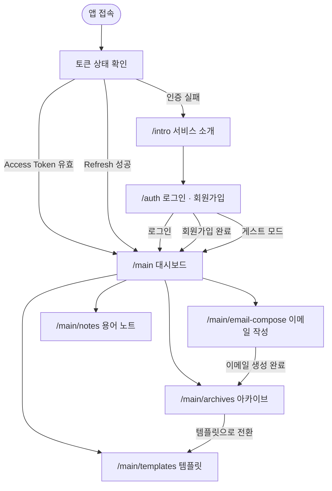

# SayitRight

<p align="center">
  
</p>

무엇을 어떻게 쓸지 고민하는 시간을 줄입니다.

SayItRight는 **이메일 초안을 상황에 맞게 정제**하고, 아카이브·템플릿·표현 노트를 통해 **사용자의 커뮤니케이션 역량을 축적**할 수 있도록 설계된 서비스입니다.

<p align="center">
  🌐 <a href="https://sayitright-web.vercel.app">서비스 페이지</a> &nbsp; | &nbsp;
  ⚙️ <a href="https://github.com/kw9212/sayitright-api">백엔드 리포지토리</a>
</p>

## 📑 목차

- [📝 프로젝트 동기](#-프로젝트-동기)
- [⭐ 핵심 기능 요약](#-핵심-기능-요약)
  - [✍️ 이메일 작성](#️-이메일-작성)
  - [🔖 템플릿 전환 기능](#-템플릿-전환-기능)
  - [📋 아카이브 저장 기능](#-아카이브-저장-기능)
  - [📔 직장 생활 용어 노트](#-직장-생활-용어-노트)
- [🗺️ 사용자 UI 흐름](#️-사용자-ui-흐름)
- [📚 기술 스택](#-기술-스택)
- [📁 디렉토리 구조](#-디렉토리-구조)
- [🧪 테스트](#-테스트)
- [🎢 Challenge](#-challenge)
  - [1. 게스트와 로그인 사용자를 같은 화면 구조로 처리하기](#1-게스트와-로그인-사용자를-같은-화면-구조로-처리하기)
  - [2. 로그인 없이도 데이터가 유지되는 게스트 모드 만들기](#2-로그인-없이도-데이터가-유지되는-게스트-모드-만들기)
- [✒️ 회고](#️-회고)

---

## 📝 프로젝트 동기

우리는 하루 중 일정 시간을 이메일을 확인하고 작성하는 데 사용합니다.
누군가는 이메일 확인으로 하루를 시작하기도 하고, 누군가는 특정 시간대를 따로 정해 이메일을 처리하기도 합니다.

하지만 이메일은 AI에게 전달하는 프롬프트처럼 마음 편하게 작성하기 어렵습니다.
어떤 상황인지, 수신자는 누구인지, 어떤 목적을 가지고 있는지, 혹시 빠진 내용은 없는지까지 여러 번 검토한 뒤에야 보내게 됩니다. 특히 업무 이메일일수록 이러한 꼼꼼함은 필수적이며 중요한 과정입니다.

이러한 특성 때문에 이메일 작성에서 오는 피로도는 쉽게 누적됩니다.
이메일 작성과 확인에 많은 에너지를 쓰다 보면 다른 업무에 온전히 집중하기 어려워지기도 합니다. 심지어 그렇게 시간을 들여 작성했음에도 표현이 아쉽거나 작은 실수가 발생하기도 합니다.

> 키워드와 상황만 입력하면 자연스럽게 이메일을 작성해주는 서비스가 있다면, 불필요한 피로도는 줄이고 실수 가능성도 낮출 수 있지 않을까?

SayItRight은 이러한 고민에서 출발한 서비스입니다.

---

## ⭐ 핵심 기능 요약

### ✍️ 이메일 작성

초안에 의도만 담아 입력하고, 수신자·목적·톤과 같은 조건을 선택하면 상황에 맞게 정제된 이메일을 생성합니다.

고급 기능을 사용할 경우, 작성된 이메일에 대해 표현 선택의 이유와 개선 포인트를 설명하는 피드백도 함께 제공합니다.

---

### 🔖 템플릿 전환 기능

자주 사용하는 표현이나 구조가 있다면 생성된 이메일을 템플릿으로 저장해 재사용할 수 있습니다.

템플릿은 수정이 가능하며, 검색 기능을 통해 필요한 템플릿을 빠르게 찾을 수 있습니다.

---

### 📋 아카이브 저장 기능

생성한 이메일은 아카이브에 저장되어 날짜, 수신자, 내용, 키워드 검색을 통해 다시 확인할 수 있습니다.

여러 이메일을 관리해야 하는 상황에서도 필요한 내용을 빠르게 찾아볼 수 있습니다.

---

### 📔 직장 생활 용어 노트

조직에서 자주 사용하는 표현이나 업무 용어를 나만의 노트로 정리할 수 있습니다.

각 용어마다 설명과 예시를 함께 기록할 수 있고, 중요한 항목은 표시해 한눈에 확인할 수 있습니다.

---

## 🗺️ 사용자 UI 흐름



---

## 📚 기술 스택

| 기술 | 선택 이유 |
|---|---|
| Next.js 16 / React 19 | 화면 라우팅, API 프록시, 클라이언트 UI 구성을 한 프로젝트 안에서 관리하기 위해 사용했습니다. |
| TypeScript | API 응답, 저장소 인터페이스, 화면 상태의 타입을 맞춰 런타임 오류를 줄이기 위해 사용했습니다. |
| Tailwind CSS 4 | 화면 스타일을 빠르게 조정하고 컴포넌트 단위로 일관된 UI를 구성하기 위해 사용했습니다. |
| shadcn/ui (Radix UI) | 접근성 기반 UI 컴포넌트를 활용해 폼, 모달, 선택 UI를 안정적으로 구성했습니다. |
| TanStack Query | 목록 조회, 캐시 무효화, 삭제·즐겨찾기 같은 변경 작업 후 화면 동기화를 일관되게 처리하기 위해 사용했습니다. |
| React Hook Form / Zod | 입력 폼 상태와 검증 규칙을 분리해 폼 로직을 단순하게 유지했습니다. |
| IndexedDB / localStorage | 게스트 사용자의 구조화된 데이터는 IndexedDB에 저장하고, 단순 사용량 카운터는 localStorage로 관리했습니다. |

---

## 📁 디렉토리 구조

```
src/
├── app/
│   ├── api/                          # Next.js API Routes
│   │   ├── ai/generate-email/        # 이메일 생성 프록시
│   │   ├── auth/                     # 로그인 · 회원가입 · 토큰 갱신
│   │   ├── proxy/[...path]/          # 백엔드 프록시
│   │   └── users/me/                 # 사용자 정보 조회
│   ├── auth/                         # 로그인 · 회원가입 페이지
│   ├── intro/                        # 서비스 소개 페이지
│   ├── main/
│   │   ├── email-compose/            # 이메일 작성
│   │   ├── archives/                 # 아카이브
│   │   ├── templates/                # 템플릿
│   │   └── notes/                    # 용어 노트
│   ├── layout.tsx
│   └── providers.tsx                 # QueryClientProvider
├── components/
│   ├── layout/                       # 공통 레이아웃
│   └── ui/                           # shadcn/ui 컴포넌트
└── lib/
    ├── auth/                         # AuthContext · token store
    ├── repositories/                 # API / Guest Repository
    ├── storage/                      # IndexedDB · localStorage 유틸
    └── utils/                        # 공통 유틸리티
```

---

## 🧪 테스트

단위/통합 테스트는 **Jest + React Testing Library**, E2E 테스트는 **Playwright**로 구성되어 있습니다.

| 구분 | 현재 확인 내용 |
|---|---|
| 단위/통합 테스트 | Repository, storage, auth, 주요 페이지·컴포넌트 테스트 구성 |
| E2E 테스트 | auth, guest mode, archives navigation 테스트 구성 |

테스트 전략은 화면 전체에 영향을 주는 공통 레이어를 우선 검증하는 방향입니다. 특히 Repository, storage, auth context는 게스트/로그인 모드 전환과 데이터 흐름의 기반이기 때문에 중점적으로 테스트했습니다.

### 실행 방법

```bash
npm test
npm run test:coverage
npm run test:e2e
```

---

## 🎢 Challenge

### 1. 게스트와 로그인 사용자를 같은 화면 구조로 처리하기

**문제**

SayItRight는 로그인하지 않아도 핵심 기능을 체험할 수 있는 게스트 모드를 지원합니다. 그런데 게스트는 브라우저 저장소를 사용하고, 로그인 사용자는 백엔드 API를 사용합니다.

화면 컴포넌트가 이 차이를 직접 알게 만들면 문제가 커집니다. 노트, 아카이브, 템플릿 화면마다 "게스트면 IndexedDB, 로그인 사용자면 API" 같은 분기가 반복되고, 저장 방식이 바뀔 때마다 여러 화면을 함께 수정해야 합니다.

**고민**

중요한 기준은 "화면은 데이터가 어디에 저장되는지 몰라도 된다"였습니다. 사용자는 같은 화면에서 같은 동작을 기대하므로, 컴포넌트도 목록 조회, 생성, 수정, 삭제 같은 공통 동작만 호출하도록 만들고 싶었습니다.

**해결**

저장소 접근을 Repository 단위로 분리했습니다. 로그인 사용자는 API Repository가 백엔드와 통신하고, 게스트 사용자는 Guest Repository가 IndexedDB를 사용합니다. 화면에서는 현재 인증 상태만 보고 둘 중 하나를 선택한 뒤 같은 메서드를 호출합니다.

TanStack Query는 이 구조와 잘 맞았습니다. Repository가 API를 호출하든 브라우저 저장소를 호출하든, 화면은 같은 query/mutation 흐름으로 목록 조회, 캐시 무효화, 삭제 후 갱신을 처리할 수 있었습니다.

**결과**

노트, 아카이브, 템플릿 화면의 구조가 일관되게 유지되었습니다. 게스트 저장 방식이나 API 호출 방식이 바뀌더라도 수정 범위가 Repository 안으로 줄었습니다. 특히 노트의 즐겨찾기 토글처럼 즉각적인 반응이 필요한 기능은 TanStack Query의 낙관적 업데이트로 사용자 경험을 유지했습니다.

---

### 2. 로그인 없이도 데이터가 유지되는 게스트 모드 만들기

**문제**

게스트 모드는 단순 체험용이지만, 새로고침할 때마다 데이터가 사라지면 실제 사용 경험이 크게 떨어집니다. 사용자가 만든 아카이브, 템플릿, 노트가 브라우저를 닫았다가 다시 열어도 남아 있어야 했습니다.

동시에 게스트는 무제한으로 데이터를 만들 수 없어야 했습니다. 템플릿, 아카이브, 노트마다 다른 제한이 있고, 이메일 생성 횟수도 하루 단위로 관리해야 했습니다.

**고민**

모든 것을 localStorage에 넣으면 구현은 쉽지만 검색, 정렬, 페이지네이션을 처리하기 불편하고 구조화된 데이터를 다루기 어렵습니다. 반대로 모든 것을 IndexedDB에 넣으면 실제 데이터 저장에는 좋지만, 단순 카운터를 매번 비동기로 읽고 쓰는 흐름이 무거워집니다.

**해결**

역할을 나눴습니다. 아카이브, 템플릿, 노트처럼 구조화된 데이터는 IndexedDB에 저장했습니다. 반면 템플릿 개수, 아카이브 개수, 노트 개수, 일일 이메일 생성 횟수처럼 즉시 확인해야 하는 값은 localStorage에 저장했습니다.

이렇게 나누면서 Guest Repository는 IndexedDB에서 실제 데이터를 읽고 쓰고, 게스트 제한 유틸은 localStorage에서 카운터를 관리하게 했습니다.

**결과**

게스트 사용자는 로그인하지 않아도 만든 데이터를 다시 확인할 수 있습니다. 동시에 한도 체크는 빠르게 처리되어, 제한에 도달했을 때 화면에서 즉시 안내할 수 있습니다. 저장소의 역할이 분리되어 데이터 영속성과 사용량 제한을 각각 독립적으로 관리할 수 있게 되었습니다.

---

## ✒️ 회고

이번 프로젝트에서 가장 많이 배운 점은 "사용자 경험을 유지하려면 코드의 책임 경계가 먼저 정리되어야 한다"는 점입니다.

게스트 모드는 프론트엔드에서 단순한 분기 문제가 아니었습니다. 같은 화면이 API와 브라우저 저장소를 모두 다룰 수 있어야 했고, 저장소가 달라도 사용자는 같은 경험을 해야 했습니다.

처음에는 조건문으로도 해결할 수 있어 보였지만, 기능이 늘어날수록 조건문은 변경 비용으로 돌아왔습니다. Repository, IndexedDB/localStorage 역할 분리, TanStack Query 기반 상태 관리는 모두 변경이 잦은 부분을 따로 떼어내기 위한 선택이었습니다.
